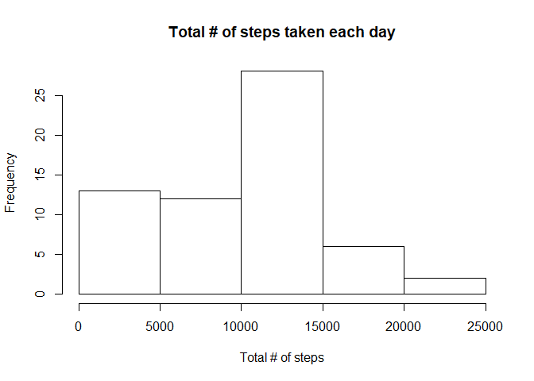
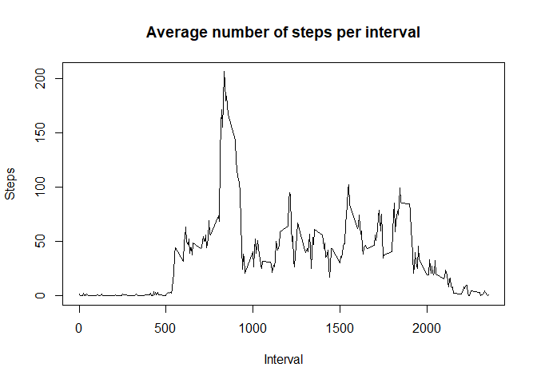
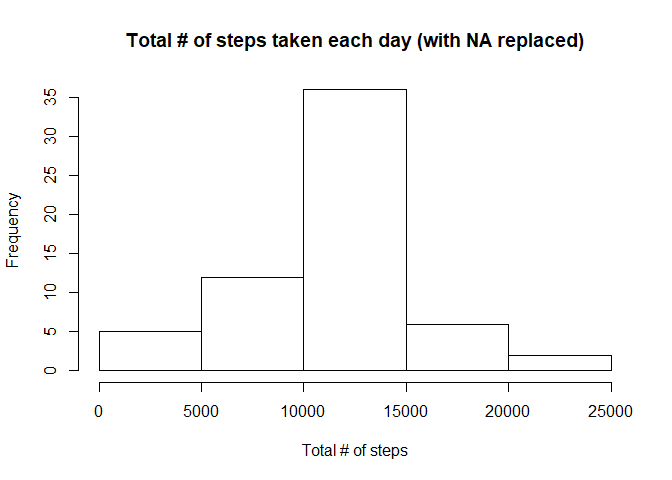

# Week 2 Assignment
Toby Kwan  
July 10, 2017  


## (Part 0) - Loading requisite libraries

```r
library(plyr)
library(lattice)
```

## Part 1 - Loading and preprocessing the data
First put the source CSV file into the working directroy, then they're read into R as below.

```r
actData <- read.csv("activity.csv", stringsAsFactors = FALSE, na.strings = 'NA')
actData$date <- as.Date(actData$date)
summary(actData)
```

```
##      steps             date               interval     
##  Min.   :  0.00   Min.   :2012-10-01   Min.   :   0.0  
##  1st Qu.:  0.00   1st Qu.:2012-10-16   1st Qu.: 588.8  
##  Median :  0.00   Median :2012-10-31   Median :1177.5  
##  Mean   : 37.38   Mean   :2012-10-31   Mean   :1177.5  
##  3rd Qu.: 12.00   3rd Qu.:2012-11-15   3rd Qu.:1766.2  
##  Max.   :806.00   Max.   :2012-11-30   Max.   :2355.0  
##  NA's   :2304
```

## Part 2 - What is mean total number of steps taken per day?
Here, the total number of steps performed per day are calculated.

```r
actByDay <- ddply(actData, "date", summarize, total = sum(steps, na.rm = TRUE))
hist(actByDay$total, main = "Total # of steps taken each day", xlab = "Total # of steps")
```

<!-- -->
And their mean/median of the

```r
mean(actByDay$total)
```

```
## [1] 9354.23
```

```r
median(actByDay$total)
```

```
## [1] 10395
```


## Part 3 - What is the average daily activity pattern?

```r
actByInterval <- ddply(actData, "interval", summarize, avgSteps = mean(steps, na.rm = TRUE))
plot(x = actByInterval$interval, y = actByInterval$avgSteps, type = "l", xlab = "Interval", ylab = "Steps",
     main = "Average number of steps per interval")
```

<!-- -->

Most steps are taken between intervals labelled '500' and ~'1800' 

## Part 4 - Imputing missing values
Here, NA values for any interval is replaced by the average for that interval, which is computed in Part 3 above.

```r
actData$rowNum <- 1:nrow(actData)
naRows <- actData[is.na(actData$steps),]$rowNum
# Copy data frame
actData2 <- data.frame(
    date = actData$date,
    interval = actData$interval,
    steps = actData$steps
)
# replace NA values by interval average
for ( row in naRows )  {
    actData2[row,]$steps = actByInterval[actByInterval$interval == actData2[row,]$interval,]$avgSteps
}
summary(actData2)
```

```
##       date               interval          steps       
##  Min.   :2012-10-01   Min.   :   0.0   Min.   :  0.00  
##  1st Qu.:2012-10-16   1st Qu.: 588.8   1st Qu.:  0.00  
##  Median :2012-10-31   Median :1177.5   Median :  0.00  
##  Mean   :2012-10-31   Mean   :1177.5   Mean   : 37.38  
##  3rd Qu.:2012-11-15   3rd Qu.:1766.2   3rd Qu.: 27.00  
##  Max.   :2012-11-30   Max.   :2355.0   Max.   :806.00
```

With the NA values imputed, the daily total values and their mean/median are calculated.

```r
actByDay2 <- ddply(actData2, "date", summarize, total = sum(steps, na.rm = TRUE))
hist(actByDay2$total, main = "Total # of steps taken each day (with NA replaced)", xlab = "Total # of steps")
```

<!-- -->

```r
mean(actByDay2$total)
```

```
## [1] 10766.19
```

```r
median(actByDay2$total)
```

```
## [1] 10766.19
```
With the NA values replaced by the interval averages, the total number of steps taken have been increased.  Days with small total number of steps have been greatly reduced (from 13 to 5)

## Part 5 - Are there differences in activity patterns between weekdays and weekends?
The factor variable 'daycat' is created based on the 'weekday' values.  The interval averages are then recalculated.

```r
actData2$daycat <- factor(ifelse((weekdays(actData2$date) == 'Sunday' | weekdays(actData2$date) == 'Saturday'),
                                 "weekend", "weekday"))
actByInterval2 <- ddply(actData2, .(interval, daycat), summarize, avgSteps = mean(steps, na.rm = TRUE))

xyplot(avgSteps ~ interval | daycat, data = actByInterval2, layout=c(1,2), type = "l",
       xlab = "Interval", ylab = "Number of steps")
```

<!-- -->

There is an observable difference in the activity pattern between weekdays and weekends.  In particular, there is a decrease in activity level on weekends.
